# Java
---
## 人机交互方式
### 1 图形界面（Graphical User Interface GUI）
### 2命令行方式（Command Line Interface CLI） 
- 场用指令：
  - 盘名字：切换盘
  - dir：显示目录
  - md 文件夹名字：在该路径下新建文件夹
  - cd 文件夹路径：打开文件夹
  - cd..：返回上级
  - cd/：返回根目录
  - del 文件名：删除文件
  - del *文件后缀：删除所有该后缀的文件
  - rd 文件夹名字：删除空文件夹
---
## 编码方式
### ASCII码
### Unicode
#### UTF-8

---
## Java技术体系
### Java SE（Standard Edition）标准版
### Java EE（Enterprise Edition）企业版
### Java ME、Java Card
---
## Java相关基础
### 特点
- 纯粹面向对象
1. 类、对象
2. 封装、继承、多态
- 舍弃了C中的指针，增加垃圾回收器：不用管内存，不需要free
- 跨平台性：利用各平台的Java Virtual Machine（JVM）运行
- 区分大小写
### 环境搭建
- JDK（Java Development Kit 开发工具包）：包换JRE+开发工具集
- JRE（Java Runtime Environment 运行环境）：包换JVM和Java SE标准库

#### 配置环境变量：用来直接调取java、javac等指令
- path变量：windows系统执行命令时查找的路径

👌 若装多版本jdk，路径设置哪个版本运行哪个版本

### 一些文件
- bin：开发工具
- db：数据库
  - include c语音写的头文件
- jre：运行环境
- lib：jar包

### 运行
- 原理：源文件（.java文件)——编译javac.exe——>字节码文件（.class文件）（文件名与源文件的类名一致，几个类几个字节码文件）——运行java.exe（只能运行包含main方法的类）——>结果
- 其中字节码文件名为源文件中的类名
- cmd编译运行步骤：
  1. 编译：javac 源文件名.java
  2. 运行：java 类名
- 一个源文件可以有多个class，但最多一个是public（该类名需要被设为源文件名）
- 含package的情况：
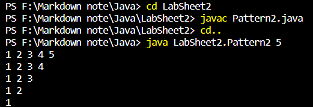
### 命名规范 Naming Guidelines:
1. 包名：多单词时全小写(lowercase)，如firstpackage
2. 类名、接口名：多单词组成时，各单词首字母大写(uppercase)，如FirstClass
3. 变量名、方法名：除第一个单词外，其他单词首字母大写，如firstFunction
4. 常量名：全大写，_连接，如FIRST_CONSTANT
#### Java Reserved Words
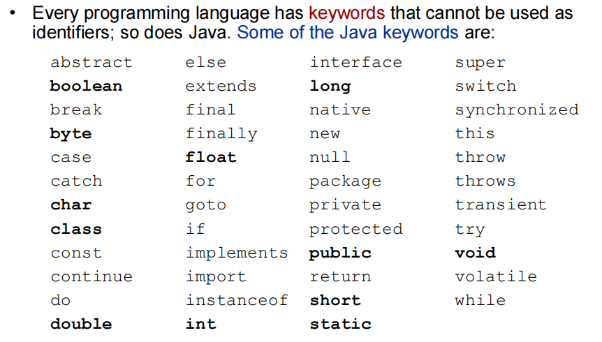

---
## 内存相关知识点辨析
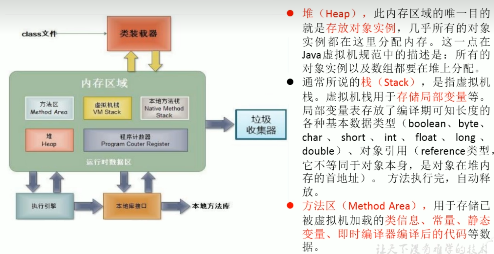
### 堆 Heap
- Garbage-collectible
- where objects live
### 栈 Stack
- local variables and methods(when called) live
#### Methods in stack
- 运行method时压入栈的是：Contains the state of the method (which line of code is executing and values of all local variables).
- Method at top of the Stack is always the method being executed.
### Local(/stack) Variables & Instance Variables
1. local variable:
   - Variables declared in a method and method parameters. 声明在方法的变量和方法参数
   - Temporary variables, alive only when the method they belong to is on the Stack. 临时变量（其所在方法被called时）
2. instance variable：
   - Variables declared in a class (not inside of a method).
   - Live inside the object they belong to.
3. 例子：
```java
public class Umamusume{
    // instance variables:每个赛马娘有一个年龄和名字
    int age;
    String name;
    
    // food 和 eatSpeed是local variables
    public void Eat(String food){
        int eatSpeed = 10;
    }
}
```
- ==**因此local variables在stack，instance variables在heap**==

### Object References
1. Object reference (aka non-primitive) variables:
   - Hold a reference to an object, not the actual object. 大概就是值传递吧（？）
   - A local variable that is a reference to an object goes on the Stack (the object it refers to still goes on the Heap)

### Life of Objects and Variables
1. **Life of an Object**: depends only on the life of reference variables referring to it. 取决于其reference variables的寿命
   - ==Object is alive (or dead) if its reference is alive (or dead).==
  1.1 Objects的内存分配：dynamically allocated and created on demand
  - memory space is ==allocated at runtime, not at compile time.==
  - the new statement causes the memory for an object to be allocated.类似C中的malloc函数
1. **Variable lifetime**:
   - same for primitive and reference variables;different for local and instance variables
  2.1 Life duration：
     - local variables: live only within the method that declared it (also referred to as being in scope); 和C一样【要区分alive（method被called）和in scope（within the method where it was declared.）
  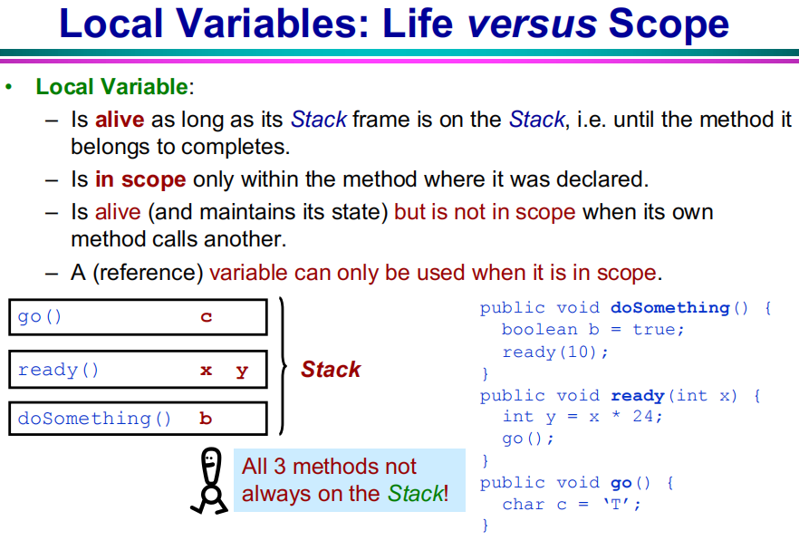
     - instance variables: live for as long as object they belong to lives.
### Garbage Collection（GC）
1. Memory Leak 内存泄漏：是指程序在申请内存后，无法释放已申请的内存空间，一次内存泄露危害可以忽略，但内存泄露堆积后果很严重，无论多少内存,迟早会被占光。memory leak会最终会导致out of memory！（java通过GC解决了这个问题）
2. Objects eligible for GC 符合GC条件的objects（定期清理）：If an object has only one reference to it and the Stack frame holding it gets popped off the Stack, then the object is now abandoned in the Heap. 其实就是没有引用了？
3. Object没有reference的方式：
  ① The reference goes out of scope, permanently.
  ② The reference is assigned to another object.
  ③ The reference is explicitly set to null.
     - ==⚠== If you use the dot operator on a null reference, you will get a NullPointerException error at runtime.
     - instance reference variables没有初始化时是null

- finalizer: 与constructor相反，有时用于cleanup of an object.
---
## Java基础语法 Java Syntax
⚠在此只记录与C不同的语法
### 文档注释
```java
/**
文档注释
注释内容可以被JDK提供的javadoc解析，生成以网页文件形式的说明文档
*/
```
- 要求的tags：
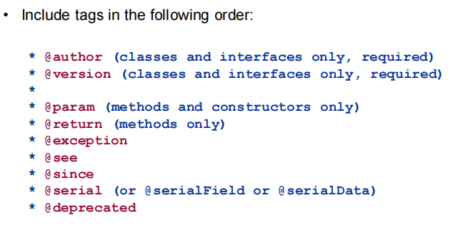
```java
/**
* class的说明
* @author 
* @version
*/

/**
* method/constructor的功能说明
* @param 参数名 解释参数
* @return 解释返回值
*/

```
生成文档：
```
javadoc -d 命名 -author -version 源文件
```
### 输出语句
```java
System.out.println(); //含\n
System.out.print(); //不含\n
```
### 数据类型
#### 基本数据类型（Primitive type）
- ==Java is strongly typed and strongly classed==
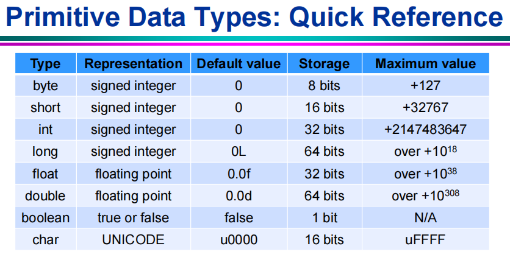
1. 整数：byte、short、int、long
   byte范围-128到127 1字节=8bit
   ```java
   long x=123456789L; //long的定义结尾必须有l或L
   ```
2. 浮点：float、double
   默认double
   ```java
   float x=1.234F; //float的定义结尾必须有f或F
   ```   
3. 字符：char
  - 若直接使用Unicode值来表示char：前面加'\u'
1. 布尔：boolean
⚠ 不同于C的是，布尔类型不存在0代表false，1代表true
#### 引用数据类型（Reference type）
1. class（string属于class）
   - String类型：+表示连接操作
2. 接口 interface
3. 数组[]
4. object: 默认是null

#### 数据类型转换 Type Cast
- Conversion between numeric types:
  byte < short < int < long < float < double
- 强制类型转换Explicit cast（高容量到低容量downcasting）直接截断，因此精度可能损失
- 自动类型提升（低到高）自动扩容
- Type cast operator:
```java
(type) expression;
```
- 与此相同的在对象中的类型转换：
  - 子类到父类：向上转型，多态性的体现
  - 父类到子类：向下转型，如果强转可能出现ClassCastException的异常，所以用到instanceof关键字：
```java
// 判断对象a是否是B的实例
if(a instanceof B){
    B b = (B) a;
}

// 可以向下转型的情况：
// 父类创子类转父类
Object obj = new Woman();
Person p = (Person)obj;

// 父类创子类转子类
Person p = new Woman();
Woman w = (Woman)p;


```

### 运算符
- ⚠i++和++i：
  - i++：先取值再运算
  - ++i：先运算后取值


```java
a = 2;
b = ++a; //b=3, a=3
c =a++; //c=2, a=3
```
- Ex:
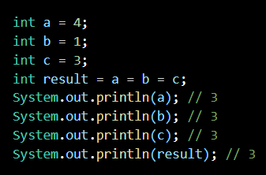
```java
int a=4;
int b=1;
int c=3;
int result = a = b = c; //从右往左依次赋值，最终result a b c都是3
```

### 数组
- 一维数组默认值 default value:
  - 整型：0
  - 浮点型的：0.0
  - char：0
  - boolean：false
  - 引用类型：null（C中用NULL，但java是null）
- 二维数组默认值：
  - 外层arr[i]：地址（若没定义列，则为null）
  - 内层同一维数组（若没定义列，则不能不赋值就调用）
```java
// 静态初始化：
int[] arr = new int[]{1,2,3};

// 动态初始化:
int[] array = new int[5];

// 获取数组的长度：length属性
int len = arr.length;

// 二维数组
int[][] arr2 = new int[][]{{1,2,3},{4,5},{6,7,8}}; //不要求其中的每个数组元素个数相同
int[][] array2 = new int[2][3]; //外层2个元素，每个元素为长度为3的数组
int[][] array2 = new int[2][]; //同C
```

- 补充：
  - 数组越界报错：ArrayIndexOutOfBounds
  - main函数的参数String[] args就是一个字符串数组，所以当在cmd运行该程序的时候，在后面输入的东西就都会传入main函数
  - 对象数组 Array of objects：注意数组中的每个元素都要实例化，Each element is a reference variable, need yo assign some actual objects
    - 直接打印的话，打印的是地址
#### ArrayList：
```java
import java.util.ArrayList
```
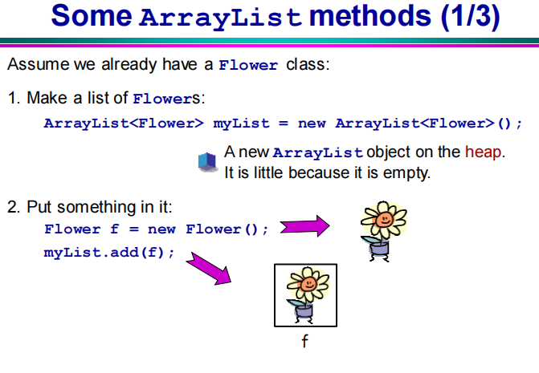
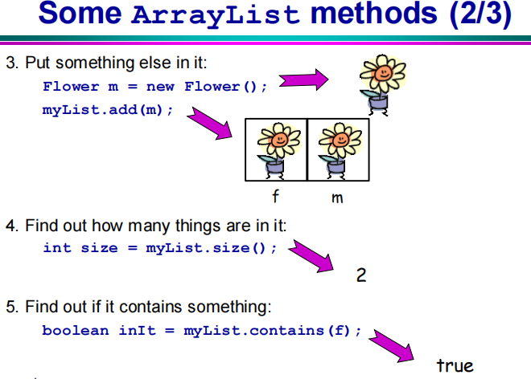
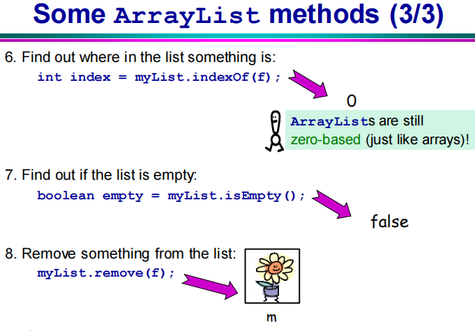
- 和数组的对比：
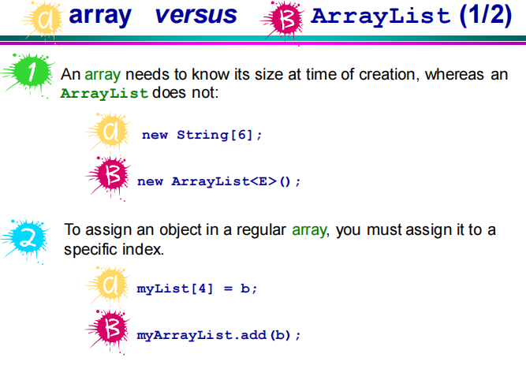
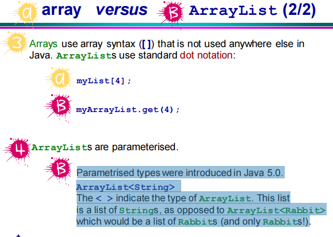

## Java面向对象
### OO Programming and Object
1. Object-Oriented(OO) programming: Constructing software systems which are structured collections of classes.
2. Object: It is a fundamental entity in Java.

### 面向过程（POP）和面向对象（OOP）
- 例子：人如何把大象装进冰箱
  - 面向过程：强调功能，以函数为最小单位
  设计以下三个函数来实现：
  ① 打开冰箱门
  ② 把大象放进冰箱
  ③ 关上冰箱门
  - 面向对象：强调具备功能的对象，以类/对象为最小单位
  设计三个类：
  ```
  人{
      打开（冰箱）{
          冰箱.开门();
      }
      抬起(大象){
          大象.进入(冰箱);
      }
      关闭（冰箱）{
          冰箱.关门();
      }
  }
  
  冰箱{
      开门(){};
      关门(){};
  }

  大象{
      进入(冰箱){
      }
  }
  ```
### 类与对象
#### 一、类（Class）：对一类事物抽象的描述
##### （一）类的成员
1. 属性 (Attribute/field/instance variable)/成员变量/域
   - 属性是定义在类中的，局部变量可以定义在方法内（或方法形参）、代码块内、构造器内（或构造器形参）
   - 属性可以指定权限
   - 属性和局部变量的区别：
     - 属性有默认初始化值
       - 整型：0
       - 浮点：0.0
       - 字符：0
       - Boolean：false
       - 引用：null
     - 加载位置不同，属性在堆中，局部变量在栈中（不考虑static）
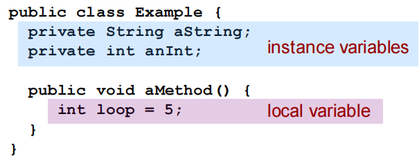
   - 赋值的先后顺序：默认——显式初始化（int a=1）——构造器初始化——对象.方法或对象.属性

2. 方法（method）/成员方法/函数
   2.1 方法的重载（overload）：一个类中的多个同名方法（参数不同，参数顺序不同也算）（与权限、返回类型等无关, The return type is NOT used to differentiate methods）
   2.2 可变个数形参：
   - 由于内存分配不确定，所以只能声明在末尾，最多只能声明一个
    ```java
    public void show(String ... strs){
      // 该方法的参数可以有0个或一个或多个字符串
    }
    ```
   2.3 一些methods in java.lang.Object：
   - equals()：判断两个对象是不是等价的(⚠：对象的比较比的是地址，如果地址不同，==返回的就是false)
     - Object类中的equals比较的是地址值，但String、Date、File等都重写了，重写后比较的是对象的属性而非地址
  ```java
  public boolean equals(Object o){
      // 将传入的对象o转换为该类
      // 如：Rabbit r = (Rabbit) o;
      if((r.getName().equals(this.getName())) &&
      // 比较每个属性
      ){
          return true
      }else{
          return false;
      }
  }  
  ```
   - toString()：返回一段字符串
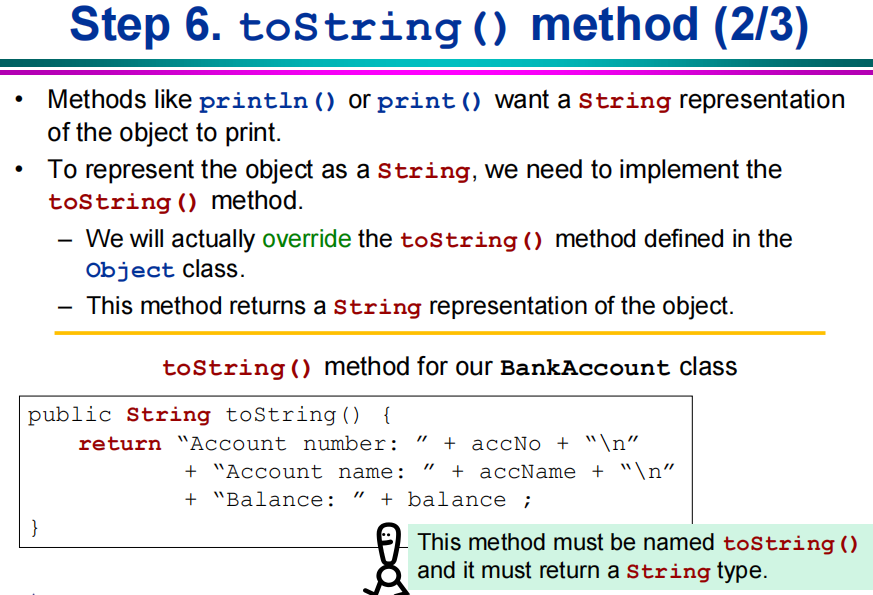
   - hashCode()：每个对象都有不同的哈希码，基于其的地址
   - getClass()：返回对象的类


3. 构造器(constructor)
   A constructor is a special method, with same name as the class name, used for initialisation. (not have a return type, not even void)
   3.1 作用：创建对象
    ```java
    // 创建类的对象：new 构造器
    Person p = new Person();
    
    class Person{
        //属性
        String name;
    }
    ```
    3.2 构造器的定义：如果没有显式的定义，系统自动提供空参构造器
    - 多个构造器彼此重载
    - 只要显式定义了，系统就不再提供默认空参构造器
    3.3 Constructor Chaining: 子类的构造器在调用时会调用父类的构造器（最后倒到Object类）
    - An object is only completely formed when all the superclass parts of itself are formed.
  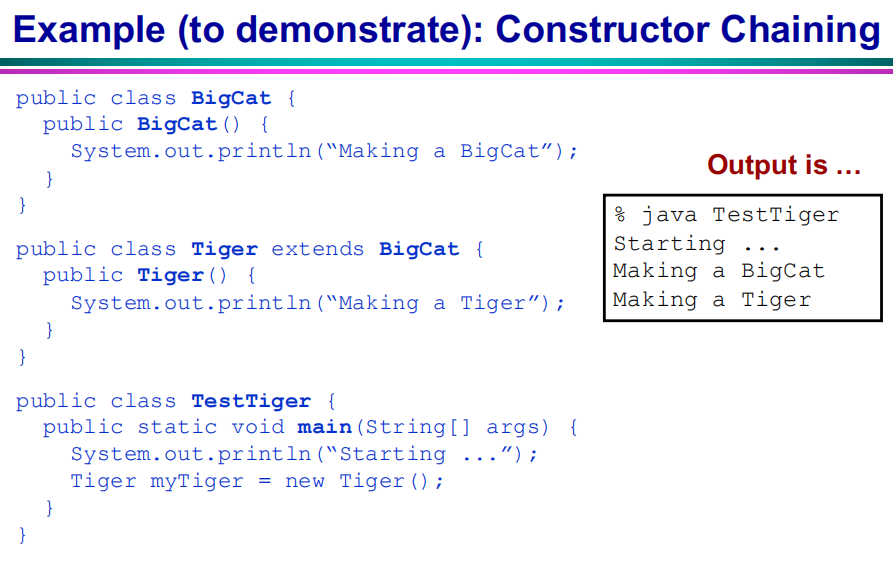
```java

Person p = new Person("Bill");

class Person{
    // 属性
    private String name;
    private int age;

    // 构造器的定义
    // 权限修饰符 类名(形参列表){}
    public Person(){
    }
    // 加入形参便于对象的初始化
    public Person(String n){
        name=n;
        age=0;
    }

    public String getName(){
        return name;
    }
    
    public int getAge(){
        return age;
    }
}
```
1. Block 代码块
  4.1 作用：初始化类、对象
  4.2 分类： 由于只能用static修饰，所以分为下面两类
    - 静态代码块：随着类的加载而执行（一次），只能调用静态结构
      - 作用：初始化类的属性
    - 非静态代码块：随着对象的创建而执行，所以每创建一个对象就执行一次
      - 作用：可以在创建对象的时候对对象初始化
  


##### （二）类的关系 Class Relationships
1. 关联 Aggregation (写作 has-a)：在一个类中声明另一个类的属性，即Objects are instance variable in the class
   - 类似于Kitchen和Refrigerator的关系，Kitchen中包含Refrigerator
2. 继承 Inheritance (写作 is-a)：继承一个类中的属性、方法
   2.1 格式：
   If class B extends class A, then class B is class A
   If class C extends class B, then class C is class A **and** B
    ```java
    public class B extends A{
    }
    ```
   2.2 一些概念名称：
   - 子类/派生类 subclass：继承别的类的类，如上面那个例子里的B
   - 父类/超类/基类 superclass：被继承的类，如A
  
   2.3 ⚠ Note：
   - Subclasses inherit the properties(attributes and operations) of their superclass.
   - Any private instance variables and methods are not inherited and cannot be seen by the subclass. private不被继承
   - 当class K为class J的subclass时, objects can be cast to another class
        ```java
        J j = new K();
        K k = (K) j;
        ```


   2.4 重写 Override：在subclass中对其superclass中的method进行改写
     - 要求：
       - 方法名、形参列表和返回值类型相同（如果返回值是一个类，那么可以改成该类的子类）
       - 权限修饰符的更改只能大于等于原来（private方法不能重写）
       - 抛出的异常类型小于等于原来


##### （三）特殊的类 java.lang.Object
-  java.lang.Object是所有java类的ultimate parent (It is implicitly inherited by every class)


#### 二、对象（Object）/实例（Instance）：实际存在的某类事物的某个个体
- 创建一个对象，变量存放的是该对象在堆中的地址，对象名是引用的对象的地址，因此将一个对象赋给另一个对象后，再改变该对象的属性会导致另一个对象的该属性改变
- Instance variables are what makes individual object unique
- 2 objects with the same state are not the same object
- 内存解析：
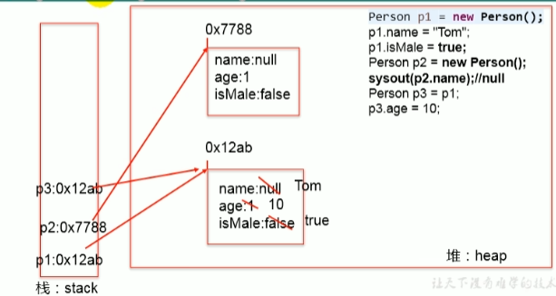
```java
Person p2 = p1;
p2.age = 10; //此时p1.age=10
```
- 匿名对象：创建对象但不命名，所以只能调用一次
  - 用法：作为形参传入方法
```java
PhoneMall mall = new PhoneMall();
// 匿名对象的应用
mall.show(new Phone());

其中：
class PhoneMall{
    public void show(Phone phone){
        phone.sendEmail();
        phone.playGame();
    }
}
```

### 封装性 Data Encapsulation/Information Hiding
When the internal state and operation are hidden from others.
一、权限修饰符 Access Modifiers
1. 从小到大：private, "default", protected, public
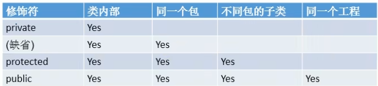
2. 可以修饰类（public/"default"）及类的内部结构：属性、方法、构造器、内部类
```java
public class Test{
    public static void main(String[] args){
        Animal dog = new Animal();
        //dog.age = 1; 不能这样赋值
        dog.setAge(1);
    }
}

public class Animal{
    private int age;
    
    // Mutator/setter: 设置属性的值
    public int setAge(int num){
      if(num>0){
        age=num;
      }else{
        age=0;
      }
    }
    
    // Accessor/getter: 获取属性值
    public int getAge(){
      return age;
    }
}
```
### 多态性 Polymorphism
1. 表现：父类的对象指向子类的引用。Using a single definition(superclass) with different types(subclass)
- the object of subclass can be treated as object of superclass. 
   - 只适用于方法，不适用于属性
   - 是运行时行为

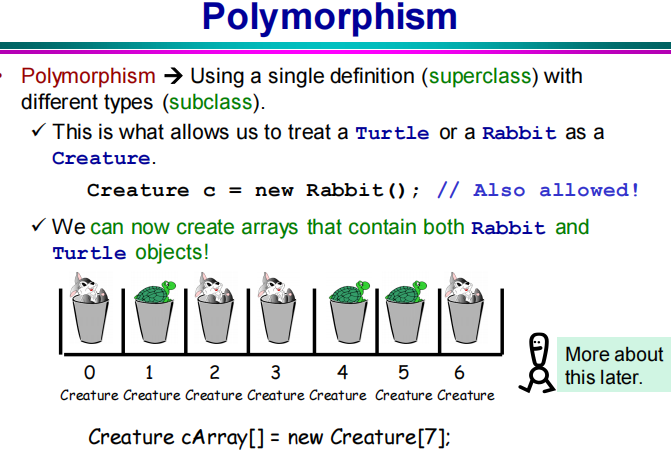
```java
public class Creature{
}

public class Umamusume extends Creature{
}

public class Human extends Creature{
}

public class Test{
    public static void main(String[] args){
        // （对象的）多态性：
        Creature mrCB = new Umamusume();
        Creature dorena = new Human();
        // 由于声明的是Creature类的引用类型，所以只能调取Creature类里的属性和方法（如果子类重写了，运行的是子类重写的方法——虚拟方法调用），不能调用子类中特有的内容
    }
}
```
2. 使用：虚拟方法调用
   - 在编译时只能调用父类中声明的方法，但在实际运行时运行的是子类重写的方法。
   - 虚拟方法：此时父类的方法
3. 接口体现多态性：由于接口不能实例化，所以要想使用接口，必须涉及多态性的体现

### 接口 Interface
1. 作用：由于Java不支持多重继承（即一个类只能继承一个父类），所以提出接口来实现多重继承的效果
从几个类中派生出一个子类/从几个类中抽取一些共同的行为特征（但他们之间没有继承关系，仅仅是具有相同的行为特征而已，例如：鼠标、键盘、移动硬盘都支持USB连接）
   - ==接口和类是并列的结构==
2. 定义：
```java
interface Flyable{
    // 全局常量
    public static final int MAX_SPEED = 7000;
    // 抽象方法
    public abstract void fly();
}
class Plane implements Flyable{
    public void fly(){
        System.out.println("起飞");
    }
}
```
- JDK7及以前，接口内部只能定义全局常量和抽象方法
- JDK8，还可以定义静态方法、默认方法
- 不能定义构造器（即不能实例化）
- 类通过implements来使用接口，成为实现类
- 实现类需要实现（就是重写，但重写抽象方法叫做实现）接口中的所有抽象方法才可以实例化
- 继承+实现：
  ```java
  class A extends B implements C,D,E,...{
  }
  ```
- 接口间可以多继承
- 与抽象类的相同点：都不能被实例化
- 匿名使用的四种情况
```java
public class Test{
    public static void main(String[] args){
        Computer computer = new Computer();
        // 由于接口不能实例化，所以必须造一个USB接口的实现类的对象（体现多态）
        // 1. 创建接口的非匿名实现类的非匿名对象
        Flash flash = new Flash();
        computer.transferData(flash);
        
        // 2. 创建接口的非匿名实现类的匿名对象
        computer.transferData(new Printer());

        // 3. 创建接口的匿名实现类的非匿名对象
        USB phone = new USB(){
            public void start(){
                System.out.println("手机工作");
            }
        };
        computer.transferData(phone);

        // 4. 创建接口的匿名实现类的匿名对象
        computer.transferData(new USB(){
            public void start(){
                System.out.println("mp3工作");
            }
        });
    }
}

class Computer{
    // USB接口规范了如果想要调用电脑传输数据，则只有USB接口的实现类才可以传输
    public void transferData(USB usb){
        usb.start();
    }
}

interface USB{
    void start();
}

class Flash implements USB{
    public void start(){
        System.out.println("U盘工作");
    }
}

class Printer implements USB{
    public void start(){
        System.out.println("打印机工作");
    }
}

```
---
### JavaBean
1. 定义：满足以下条件的Java类：
   - public
   - 有一个无参的public构造器
   - 有属性，且有对应的get、set方法
### UML (Unified Modelling Language)类图
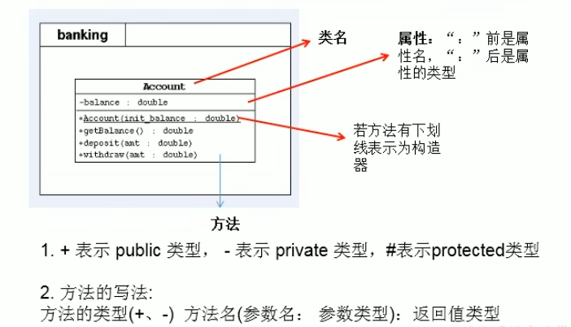
### this关键字
1. 在类的方法/构造器中，用“this.属性”或“this.方法”调用当前对象的属性或方法，通常省略（如果方法/构造器形参和类的属性同名，需要使用this表明变量是属性。
```java
public class Person{
    private String name;
    
    public void setName(String name){
        this.name = name;
    }
}
```
1. this调用构造器：在类的构造器中，可以通过“this(形参列表)”调用本类中其他构造器。每个构造器最多只能调一个
```java
public class Person{
    private String name;
    private int age;
    
    public Person(){
        age = 0;
    }
    
    public Person(String name){
        this();
        this.name = name;
    }
}
```

### super关键字
1. 可以调用父类的属性、方法、构造器
2. 使用情景：当子类对父类中的方法进行重写后，仍想调用父类的该方法时/子父类中有同名属性想调用父类属性，用super关键字，类似this
   - 一般情况下，即没有重写也没有重名时调用父类属性/方法时只是省略了super关键字，同前面所写的this
```java
public class Person{
    int id; // 身份证号    

    public void eat(){
        System.out.println("吃饭");
    }
}

public class Student extends Person{
    int id; // 学号
    public void eat(){
        System.out.println("学生爱吃肉");
    }

    public void showId(){
        System.out.println(id); //打印学号
        System.out.println(this.id); //打印学号
        System.out.println(super.id); //打印身份证号

        System.out.println(super.eat()); //调用父类Person中的eat方法
    }
}
```
2. 调用构造器的情况：
==子类构造器中在不显式设置的情况下默认存在一个父类空参构造器，所以如果父类不存在空参构造器，子类报错==
```java
public class Person{
    String name;
    int age;
    
    public Person(String name,int age){
        this.name = name;
        this.age = age;
    }
}

public class Student extends Person{
    String major;
    
    public Student(){
        super(); //实际存在，但一般被省略
    }
    
    public Student(String name,int age,String major){
        super(name,age);
        this.major = major;
    }
}
```

### package关键字
1. 为了更好实现项目中类的管理
2. 声明类或接口所属的包，声明在源文件首行
3. 命名：一个“.”隔开，代表一层文件目录
### import关键字
1. 在源文件中导入指定包下的类、接口

### static关键字
1. static属性
   - 对比静态属性和非静态属性（实例变量）：
     - 多个对象共用一个静态变量，所以通过一个对象修改静态变量时，其他对象中该属性也被更改
   - 可以通过“类.静态变量”来调用
   - 存储在方法区的静态域中
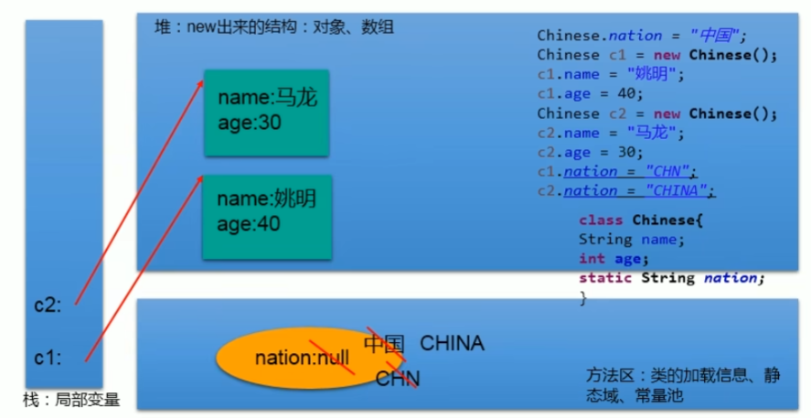
2. static方法
   - 可以直接用“类.静态方法”调用
   - 静态方法/属性的加载早于对象的实例化，跟着类的加载一起加载，因此静态方法只能调用静态方法/静态属性
   - ⚠ main方法：也是静态方法，为什么能调用非静态方法/属性，是因为在main方法中先实例化了对象，之后通过对象调的。
3. static代码块（见代码块分类）
4. static内部类

### abstract关键字
1. 抽象类 abstract class：不能被实例化的类，prevent one class from becoming an object instance.
   - 用于被继承 The only use it has is in being extended.
   - Abstract method：must be overriden in the subclass
2. 具象类 Concrete class：就是没有abstract修饰的类
3. 抽象方法：没有方法体, so the method must be overridden in the child class
   - 必须在抽象类中，但抽象类中不一定有抽象方法
     - 所以非抽象子类中必须重写该方法
   - 应用场景：父类无法定义，于是将该方法设为抽象方法，到具体子类中再重写
```java
public abstract void func();
```

### final关键字
1. final类：不能被继承
- 比如 String、System、StringBuffer
2. final方法：不能被override（重写）
- 比如 Object类中的getClass()
3. final变量：变成常量
  3.1 final属性：因为随着类的加载而创建，所以要求此时就被赋值，所以可以显式赋值/代码块中赋值/构造器中赋值

- static final：
  - 属性：全局常量
  - 方法

### MVC设计模式
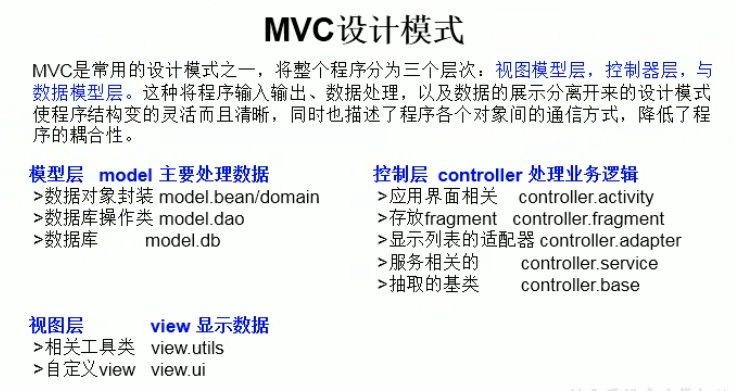

---
## 设计模式
优选出的代码结构、编程风格以及解决问题的思考方法
### 单例
